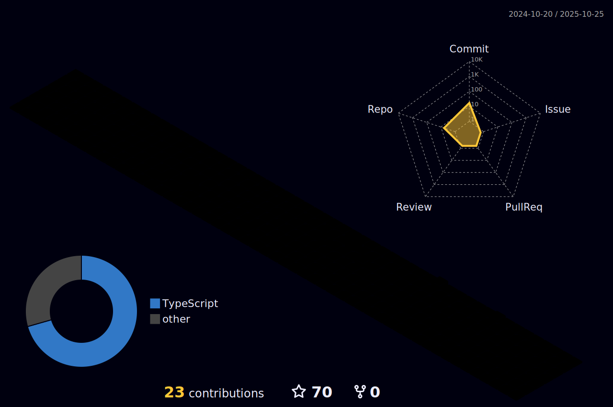

##  Hi there, I'm Pedro Lima

---

- 🔭 Frontend developer
- 🌱 Technician graduated in systems development from the school Dr Demétrio azevedo Jr.
- 📫 Contact me by email: pedrolima3dev@gmail.com
- ☕ I love coffee

  <a href="https://github.com/phlima3">
  
  
  

  
  
  ## 🛠 Tech Stack
  

 
  
  
  
  
  
  
  
  
  
  
  
  
  
  
  
  
  
  
  
   
  
  
  

  
  
  
 

  
  ##
  
  
 
  
  
    

 

